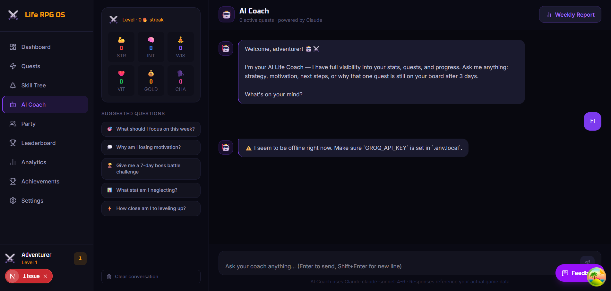
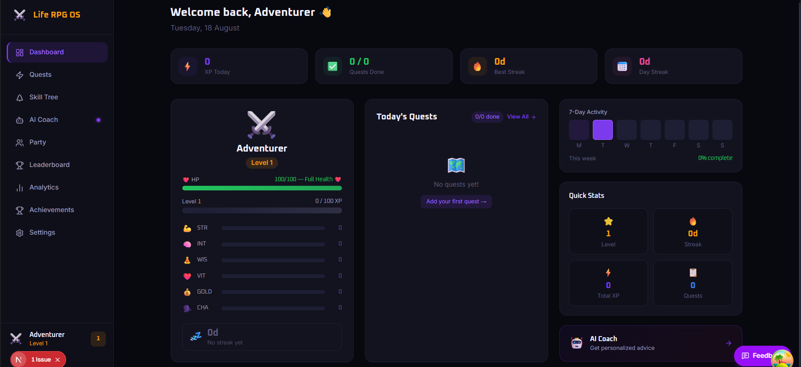
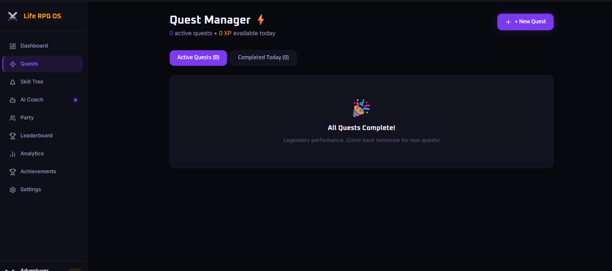
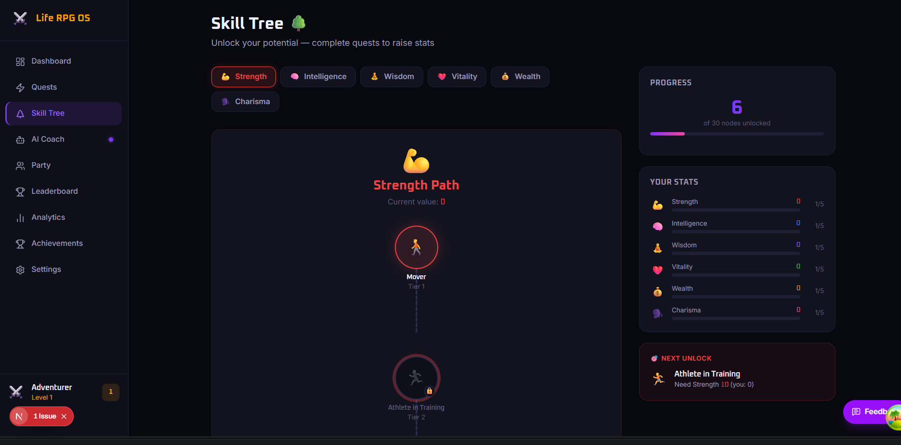
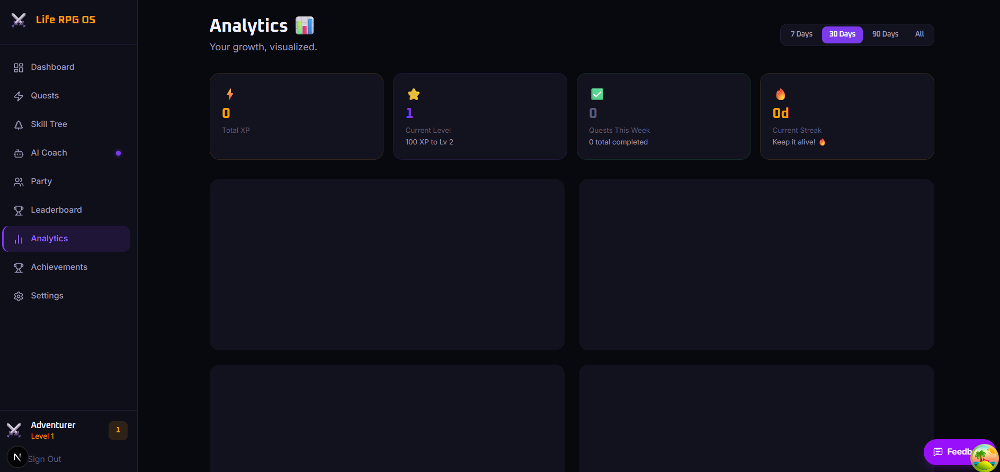
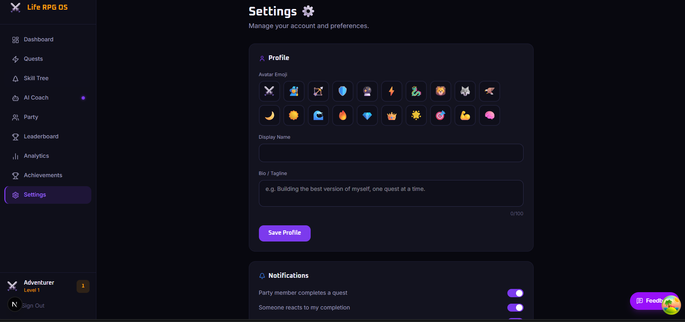

# ⚔️ Life RPG OS

> A gamified personal-growth platform that turns everyday habits into quests, progress into XP, and consistency into real-life character growth.

[](https://life-rpg-os-chi.vercel.app/)


**[Open the live app →](https://life-rpg-os-chi.vercel.app/)** · [Features](./FEATURES.md) · [API notes](./API.md) · [Deployment guide](./DEPLOYMENT.md)

Life RPG OS makes self-improvement feel like an RPG. Users create a character, define quests, earn XP, protect streaks, develop six life stats, collaborate with friends, and receive data-aware guidance from an AI coach.

---

## Table of contents

- [Live preview](#live-preview)
- [Product capabilities](#product-capabilities)
- [How it works](#how-it-works)
- [Project status](#project-status)
- [Architecture](#architecture)
- [Tech stack](#tech-stack)
- [Getting started](#getting-started)
- [Environment variables](#environment-variables)
- [Database and Supabase setup](#database-and-supabase-setup)
- [API routes](#api-routes)
- [Deployment](#deployment)
- [Security and operational notes](#security-and-operational-notes)
- [Repository structure](#repository-structure)

---

## Live preview

**Production:** [https://life-rpg-os-chi.vercel.app/](https://life-rpg-os-chi.vercel.app/)

| Landing page | Authentication |
| --- | --- |
|  |  |
| Player dashboard | Quest management |
|  |  |
| Analytics | Social experience |
|  |  |

---

## Product capabilities

### Character, habits, and progression

- Create a player identity with a display name and RPG avatar.
- Convert habits into quests with difficulty, XP reward, stat category, and emoji.
- Complete a quest to gain XP, increase relevant stats, extend streaks, and trigger level-up feedback.
- Track six core attributes: **Strength, Intelligence, Wisdom, Vitality, Gold, and Charisma**.
- View health, XP-to-next-level, daily progress, streaks, and achievement progress from the dashboard.
- Manage quests with create, edit, reorder, archive, and completion flows.

### Motivation and insights

- Visual skill tree for long-term progression.
- Achievement system with unlock states and reward feedback.
- Personal analytics for activity, XP history, stat trends, and completion patterns.
- Daily progress summaries, perfect-day celebration states, and motivational UI moments.
- Sound effects and mobile-friendly interactions for quest completion.

### AI coach

- Context-aware coaching based on profile data, active habits, recent completions, and progress signals.
- AI-generated insights and weekly reports through Groq-backed API routes.
- Basic request-rate limiting to protect the coaching endpoint.

### Social accountability

- Party creation and invite links for co-op accountability.
- Party activity, shared progress, and member views.
- Couple mode with pairing links and comparative progress.
- Public leaderboard and profile pages.
- Shareable XP cards and achievement cards for social sharing.
- Referral and invitation flows.

### Platform, admin, and reliability

- Responsive marketing site, authentication screens, onboarding, and app shell.
- Installable PWA with manifest, service worker, and push-notification support.
- Admin-only overview, user management, feedback, app configuration, and error-log screens.
- User feedback widget available inside authenticated app views.
- Client-side error boundary and error logging integration.
- Maintenance mode and suspended-account routing checks.

---

## How it works

```text
Sign up → Create character → Choose goals → Receive starter quests
   ↓
Complete daily quests → Earn XP and stat growth → Maintain streaks
   ↓
Unlock achievements → Review analytics → Get coaching → Level up
   ↓
Invite friends/partner → Build accountability → Share progress
```

---

## Project status

| Area | Current implementation |
| --- | --- |
| Web app | Next.js App Router application deployed to Vercel |
| Backend | Supabase Auth, Postgres, RLS, and Realtime |
| Core loop | Onboarding, quests, XP, stats, streaks, and levels |
| Social | Parties, couple mode, leaderboard, profiles, referrals |
| Intelligence | Groq-powered coaching and weekly reports |
| Operations | Admin routes, feedback, error logs, scheduled job endpoints |
| Distribution | SEO routes, Open Graph sharing cards, PWA assets, push support |

> **Launch checklist:** Run the listed Supabase SQL scripts, configure production environment variables, configure Supabase Auth redirect URLs, and test the login/onboarding flow on the deployed URL before inviting users.

---

## Architecture

```text
Browser / PWA
    │
    ├── Next.js 16 UI (App Router, React 19, Tailwind, Framer Motion)
    │       │
    │       ├── Vercel serverless route handlers
    │       │       └── Groq AI coach, cron jobs, push-notification endpoints
    │       │
    │       └── Supabase client
    │               ├── Authentication and sessions
    │               ├── PostgreSQL application data
    │               ├── Row Level Security policies
    │               └── Realtime subscriptions
    │
    └── Vercel deployment, cron schedule, and static asset delivery
```

---

## Tech stack

| Layer | Technology | Purpose |
| --- | --- | --- |
| Framework | Next.js 16 + React 19 | App Router, SSR, route handlers, and UI |
| Language | TypeScript | Strict type checking across the app |
| Styling | Tailwind CSS 4 | Responsive visual system |
| Motion | Framer Motion | Progress, modal, and gesture animations |
| Data fetching | TanStack Query | Client data caching and invalidation |
| Backend | Supabase | Auth, Postgres, RLS, and Realtime |
| AI | Groq SDK | Coach chat and weekly reports |
| Charts | Recharts | Analytics visualisation |
| PWA | next-pwa + Web Push | Installation and notification support |
| Deployment | Vercel | Hosting, functions, and scheduled jobs |

---

## Getting started

### Prerequisites

- Node.js 20 or newer
- npm 10 or newer
- A Supabase project
- A Groq API key for AI coaching

### Install and run

```bash
git clone https://github.com/Vishaldubey2210/Life_RPG_OS.git
cd Life_RPG_OS
npm install
npm run dev
```

Open [http://localhost:3000](http://localhost:3000).

### Production check

```bash
npm run build
npm run start
```

---

## Environment variables

Create `.env.local` in the project root. Never commit this file.

| Variable | Required | Description |
| --- | --- | --- |
| `NEXT_PUBLIC_SUPABASE_URL` | Yes | Supabase project URL |
| `NEXT_PUBLIC_SUPABASE_ANON_KEY` | Yes | Browser-safe Supabase anonymous key |
| `SUPABASE_SERVICE_ROLE_KEY` | Yes for cron/admin server tasks | Server-only Supabase service-role key |
| `NEXT_PUBLIC_APP_URL` | Yes in production | Canonical app URL used for auth redirects |
| `GROQ_API_KEY` | Yes for AI coach | Groq API key; keep server-only |
| `CRON_SECRET` | Yes for Vercel cron jobs | Random string that authorises scheduled requests |
| `NEXT_PUBLIC_VAPID_PUBLIC_KEY` | Optional | Browser push public key |
| `VAPID_PRIVATE_KEY` | Optional | Server-only push private key |
| `VAPID_EMAIL` | Optional | Push-contact email address |

Example:

```env
NEXT_PUBLIC_SUPABASE_URL=https://your-project.supabase.co
NEXT_PUBLIC_SUPABASE_ANON_KEY=your-anon-key
SUPABASE_SERVICE_ROLE_KEY=your-service-role-key
NEXT_PUBLIC_APP_URL=http://localhost:3000
GROQ_API_KEY=your-groq-key
CRON_SECRET=a-long-random-string
```

---

## Database and Supabase setup

Run these SQL scripts in the Supabase SQL Editor, in order:

1. `supabase-schema.sql` — profiles, stats, habits, completions, triggers, and core functions.
2. `supabase-day4.sql` — achievement and analytics support.
3. `supabase-day5-referral.sql` — referrals and sharing support.
4. `supabase-day6-admin.sql` — admin flags, feedback, app config, error logs, and metrics.

### Auth configuration

In **Supabase Dashboard → Authentication**:

1. Enable Email/Password authentication.
2. Set **Site URL** to the production Vercel URL.
3. Add these Redirect URLs:

   ```text
   http://localhost:3000/**
   https://your-project.vercel.app/**
   ```

4. Configure Google OAuth in both Supabase and Google Cloud before enabling the Google button for users.
5. Confirm the `on_auth_user_created` database trigger exists; it creates a profile and stats record for each new account.

---

## API routes

| Route | Method | Purpose |
| --- | --- | --- |
| `/api/coach` | `POST` | Streams a personalised AI coach response |
| `/api/coach/weekly-report` | `POST` | Produces a weekly AI progress report |
| `/api/analytics/insights` | `POST` | Generates analytics insight content |
| `/api/push/subscribe` | `POST` | Stores a browser push subscription |
| `/api/push/send` | `POST` | Sends push notifications when configured |
| `/api/notifications/read` | `PATCH` | Marks notifications as read |
| `/api/cron/daily-reminder` | `GET` | Scheduled daily reminder task |
| `/api/cron/daily-metrics` | `GET` | Scheduled daily metrics snapshot |
| `/api/cron/weekly-snapshot` | `GET` | Scheduled weekly snapshot task |
| `/auth/callback` | `GET` | Exchanges Supabase OAuth/email code for a session |

Cron routes require the `Authorization: Bearer <CRON_SECRET>` header and are configured in `vercel.json`.

---

## Deployment

The application is configured for Vercel.

1. Push the repository to GitHub.
2. Import it in Vercel and select the **Next.js** preset.
3. Keep the defaults:

   ```text
   Root Directory: ./
   Install Command: npm install
   Build Command: npm run build
   Output Directory: Next.js default
   ```

4. Add the environment variables above for **Production** and **Preview**.
5. Set `NEXT_PUBLIC_APP_URL` to your deployed URL.
6. Update Supabase Auth Site URL and Redirect URLs with that same production domain.
7. Redeploy and test sign-up, email confirmation, login, onboarding, quest completion, and logout.

For the full checklist, see [DEPLOYMENT.md](./DEPLOYMENT.md).

---

## Security and operational notes

- Use Supabase Row Level Security for all user-owned data.
- Do not expose `SUPABASE_SERVICE_ROLE_KEY`, `GROQ_API_KEY`, VAPID private keys, or `CRON_SECRET` in client code.
- Keep `.env.local` ignored by Git and set production secrets only in Vercel Environment Variables.
- Keep `NEXT_PUBLIC_APP_URL` aligned with the Vercel production domain to avoid email/OAuth redirect loops.
- Rotate exposed secrets immediately if they are ever pasted into chat, tickets, screenshots, or commits.
- Review error logs and feedback through `/admin`; grant `profiles.is_admin` only to trusted accounts.

---

## Repository structure

```text
src/
├── app/                 # Routes, pages, layouts, and API handlers
│   ├── (auth)/          # Authentication UI
│   ├── (marketing)/     # Landing, legal, and marketing pages
│   ├── admin/           # Admin dashboard routes
│   └── api/             # Coach, push, analytics, and cron handlers
├── components/          # Reusable UI and feature components
├── hooks/               # Data and interaction hooks
├── lib/                 # Supabase, AI, sound, rate-limit, and utility code
└── providers/           # Query and application providers

public/
├── icons/               # PWA icons
└── screenshots/         # README preview images

supabase-*.sql           # Database schema and feature migrations
vercel.json              # Scheduled Vercel cron routes
```

---

## Documentation

- [Feature inventory](./FEATURES.md)
- [API reference and notes](./API.md)
- [Deployment checklist](./DEPLOYMENT.md)

## License

Private project — all rights reserved.
